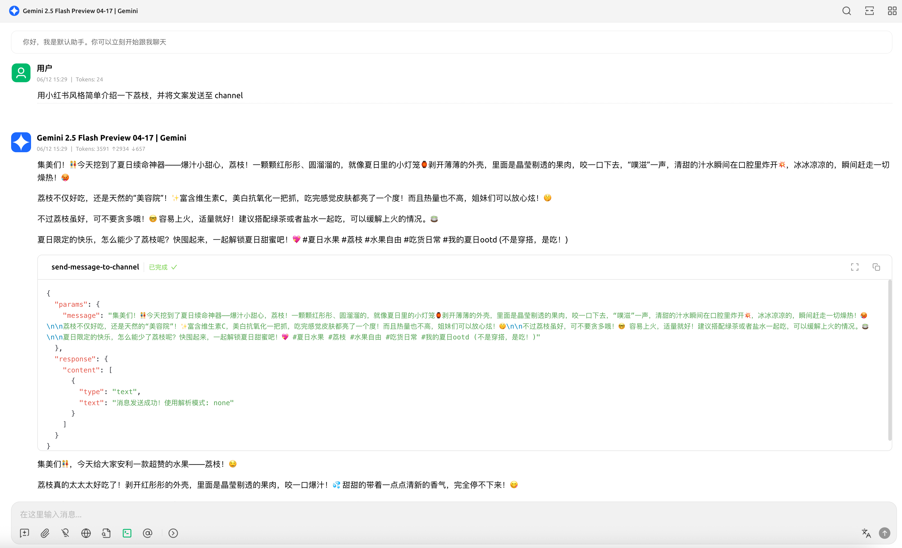
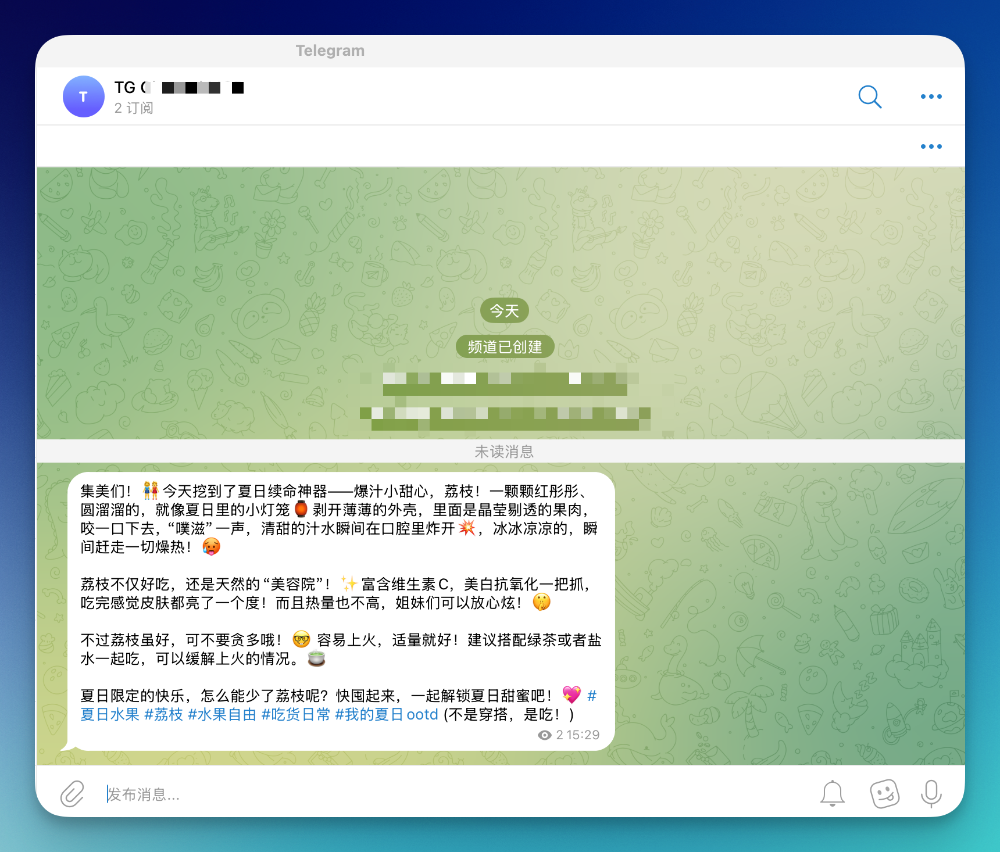

# Telegram頻道MCP服務器

這是一個基於Cloudflare Workers的MCP (Model Context Protocol) 服務器，用於向Telegram頻道發送消息。該服務器提供了一個標準化的接口，可以通過MCP協議與AI助手（如Claude Desktop）集成，實現自動化的Telegram頻道消息發送功能。

## ✨ 項目特點

- 🚀 **基於Cloudflare Workers** - 全球分布式邊緣計算，低延遲高性能
- 🤖 **MCP協議支援** - 與Claude Desktop等AI助手無縫集成
- 📱 **Telegram Bot集成** - 通過Telegram Bot API發送消息到指定頻道
- 🛡️ **TypeScript開發** - 完整的類型安全保障
- ⚡ **實時通信** - 支援SSE (Server-Sent Events) 連接
- 🔐 **安全認證** - 可選的API密鑰保護機制

## 🖼️ 圖片展示





## 🎯 主要功能

### 工具列表

#### `send-sms`
向配置的Telegram聊天或頻道發送消息

**參數:**
- `message` (string): 要發送的消息內容
- `parse_mode` (可選): 消息解析模式
  - `"none"` - 純文本（默認）
  - `"Markdown"` - Markdown格式
  - `"MarkdownV2"` - MarkdownV2格式（自動轉義特殊字符）
  - `"HTML"` - HTML格式

**功能:**
- 自動發送消息到指定的Telegram聊天或頻道
- 支援多種格式化選項
- 自動處理MarkdownV2特殊字符轉義
- 返回詳細的發送狀態確認

## 🚀 快速開始

### 前置要求

1. **Cloudflare帳戶** - 用於部署Workers
2. **Node.js 18+** - 本地開發環境
3. **pnpm** - 包管理器（推薦）
4. **Telegram Bot** - 需要創建Bot並獲取Token
5. **Telegram頻道或聊天** - 目標發送位置

### 📥 項目設置

```bash
# 克隆項目（如果從GitHub獲取）
git clone <your-repo-url>
cd telegram-channel-mcp

# 安裝依賴
pnpm install

# 複製環境變數模板
cp .dev.example.vars .dev.vars
```

### 🤖 Telegram Bot 設置

#### 1. 創建Telegram Bot

1. 在Telegram中聯繫 [@BotFather](https://t.me/BotFather)
2. 發送 `/newbot` 創建新Bot
3. 按提示設置Bot名稱和用戶名
4. **保存獲得的Bot Token**（格式：`123456789:ABCdef123...`）

#### 2. 獲取目標ID

**對於頻道：**
1. 創建Telegram頻道
2. 將Bot添加為頻道管理員，授予「發送消息」權限
3. 向頻道發送任意消息
4. 訪問：`https://api.telegram.org/bot<BOT_TOKEN>/getUpdates`
5. 在響應JSON中找到頻道ID（負數，格式：`-1001234567890`）

**對於私人聊天：**
1. 與Bot開始對話，發送任意消息
2. 訪問：`https://api.telegram.org/bot<BOT_TOKEN>/getUpdates`
3. 在響應JSON中找到您的用戶ID（正數）

### ⚙️ 環境變數配置

編輯 `.dev.vars` 文件：

```bash
# Telegram Bot配置
BOT_TOKEN="your_bot_token_here"
CHANNEL_ID="your_target_id_here"

# MCP服務器安全配置（可選但推薦）
MCP_ACCESS_KEY="your_secure_password_123"
```

**說明：**
- `BOT_TOKEN`: 從@BotFather獲取的Bot令牌
- `CHANNEL_ID`: 目標頻道ID（負數）或聊天ID（正數）
- `MCP_ACCESS_KEY`: 自定義的API訪問密鑰（增強安全性）

## 🏗️ 本地開發與測試

### 啟動本地開發服務器

```bash
# 啟動開發服務器
pnpm run dev

# 服務器將運行在: http://localhost:8787
```

### 🧪 測試MCP連接

#### 使用MCP Inspector測試

```bash
# 新終端窗口
npx @modelcontextprotocol/inspector@latest

# 瀏覽器將打開: http://localhost:5173
```

在Inspector中連接到：
- **無密鑰**: `http://localhost:8787/sse`
- **有密鑰**: `http://localhost:8787/sse?key=your_secure_password_123`

#### 測試消息發送

在Inspector中使用 `send-sms` 工具：

```json
{
  "message": "🧪 測試消息",
  "parse_mode": "none"
}
```

## 🚀 部署到Cloudflare Workers

### 1. 安裝和登錄Wrangler

```bash
# 安裝Wrangler CLI（如果未安裝）
npm install -g wrangler

# 登錄Cloudflare帳戶
wrangler auth login
```

### 2. 配置項目

檢查 `wrangler.jsonc` 配置：

```jsonc
{
  "name": "telegram-channel-mcp",  // 您的Worker名稱
  "main": "src/index.ts",
  "compatibility_date": "2025-03-10",
  "compatibility_flags": ["nodejs_compat"]
}
```

### 3. 首次部署

```bash
# 部署到Cloudflare
pnpm run deploy

# 或者使用wrangler直接部署
npx wrangler deploy
```

部署成功後，您會看到類似的輸出：
```
✨ Successfully published your Worker to telegram-channel-mcp.your-account.workers.dev
```

### 4. 設置生產環境變數

**重要：生產環境必須使用Secrets來保護敏感資訊**

```bash
# 設置Bot Token
npx wrangler secret put BOT_TOKEN
# 輸入您的實際Bot Token

# 設置頻道/聊天ID
npx wrangler secret put CHANNEL_ID
# 輸入您的目標ID

# 設置MCP訪問密鑰（強烈推薦）
npx wrangler secret put MCP_ACCESS_KEY
# 輸入您的自定義密鑰
```

### 5. 驗證部署

#### 健康檢查

```bash
curl "https://telegram-channel-mcp.your-account.workers.dev/health"
```

預期響應：
```json
{
  "status": "ok",
  "timestamp": "2024-01-01T00:00:00.000Z",
  "service": "Telegram Channel MCP Server"
}
```

#### 測試MCP連接

```bash
# 使用MCP Inspector連接到生產環境
npx @modelcontextprotocol/inspector@latest

# 連接URL: https://telegram-channel-mcp.your-account.workers.dev/sse?key=your_access_key
```

## 🔧 與AI助手集成

### Claude Desktop配置

創建或編輯 `claude-mcp-config.json`：

```json
{
  "mcpServers": {
    "telegram-channel": {
      "command": "npx",
      "args": [
        "mcp-remote",
        "https://telegram-channel-mcp.your-account.workers.dev/sse?key=YOUR_ACCESS_KEY_HERE"
      ]
    }
  }
}
```

**注意：** 將配置添加到Claude Desktop的設置文件中，而不是項目目錄。

### 其他MCP客戶端

對於支援遠程MCP的客戶端，直接使用：
- **SSE端點**: `https://your-worker.workers.dev/sse`
- **JSON-RPC端點**: `https://your-worker.workers.dev/mcp`

## 🔐 安全功能

### API密鑰驗證

如果設置了 `MCP_ACCESS_KEY`，服務器支援多種認證方式：

1. **URL參數**（推薦用於MCP客戶端）:
   ```
   https://your-worker.workers.dev/sse?key=your-access-key
   ```

2. **Authorization Header**:
   ```bash
   curl -H "Authorization: Bearer your-access-key" \
        "https://your-worker.workers.dev/sse"
   ```

3. **自定義Header**:
   ```bash
   curl -H "X-MCP-Key: your-access-key" \
        "https://your-worker.workers.dev/sse"
   ```

### 特殊端點

- `/health` - 健康檢查，無需認證
- `/sse` - MCP SSE端點，需要認證
- `/mcp` - MCP JSON-RPC端點，需要認證

## 🛠️ 技術棧

- **運行時**: Cloudflare Workers
- **開發語言**: TypeScript
- **MCP框架**: @modelcontextprotocol/sdk
- **Agent框架**: agents
- **驗證庫**: Zod
- **構建工具**: Wrangler
- **代碼規範**: Biome

## 📁 項目結構

```
telegram-channel-mcp/
├── src/
│   └── index.ts                    # 主要的MCP服務器實現
├── assets/                         # 示例圖片
├── package.json                    # 項目依賴和腳本
├── wrangler.jsonc                  # Cloudflare Workers配置
├── tsconfig.json                   # TypeScript配置
├── biome.json                      # 代碼格式化和linting配置
├── .dev.example.vars               # 環境變數示例
├── claude-mcp-config.example.json  # Claude配置示例
├── worker-configuration.d.ts       # Cloudflare Workers類型定義
├── .gitignore                      # Git忽略文件
├── STATUS.md                       # 項目狀態文檔
├── DEPLOYMENT.md                   # 詳細部署指南
├── SECURITY-GUIDE.md               # 安全功能指南
└── test-guide.md                   # 測試指南
```

## 📝 自定義開發

### 添加新的MCP工具

在 `src/index.ts` 的 `init()` 方法中使用 `this.server.tool(...)` 添加新工具：

```typescript
this.server.tool(
  "your-tool-name",
  {
    parameter: z.string().describe("參數描述"),
  },
  async ({ parameter }) => {
    // 您的工具邏輯
    try {
      const result = await yourCustomLogic(parameter);
      return { 
        content: [{ 
          type: "text", 
          text: `結果: ${result}` 
        }] 
      };
    } catch (error) {
      return { 
        content: [{ 
          type: "text", 
          text: `錯誤: ${error.message}` 
        }] 
      };
    }
  },
);
```

### 環境變數管理

- **開發環境**: 在 `.dev.vars` 文件中配置
- **生產環境**: 使用 `wrangler secret put VARIABLE_NAME` 命令設置
- **類型定義**: 在 `worker-configuration.d.ts` 中定義接口

## 🔍 故障排除

### 常見問題

1. **Bot Token無效**
   ```bash
   # 驗證Token
   curl "https://api.telegram.org/bot<BOT_TOKEN>/getMe"
   ```

2. **頻道權限不足**
   - 確保Bot被添加為頻道管理員
   - 檢查Bot是否有「發送消息」權限

3. **MCP連接失敗**
   - 檢查URL和密鑰是否正確
   - 確認Worker已正確部署

4. **部署失敗**
   ```bash
   # 檢查Worker日誌
   npx wrangler tail
   ```

### 調試命令

```bash
# 查看部署狀態
npx wrangler status

# 查看環境變數（不顯示值）
npx wrangler secret list

# 查看實時日誌
npx wrangler tail

# 重新部署
npx wrangler deploy --force
```

## 🔒 安全注意事項

1. **保護機密資訊**
   - 絕不要將Bot Token提交到代碼庫
   - 使用Wrangler Secrets管理敏感資訊
   - 設置強密碼作為MCP訪問密鑰

2. **權限最小化**
   - Bot只授予必要的頻道權限
   - 定期輪換API密鑰

3. **監控和日誌**
   - 定期檢查Worker日誌
   - 監控異常訪問模式

## 📖 進階資源

- [詳細部署指南](./DEPLOYMENT.md)
- [安全功能指南](./SECURITY-GUIDE.md)
- [測試指南](./test-guide.md)
- [項目狀態](./STATUS.md)

## 🤝 貢獻

歡迎提交Issue和Pull Request來改進這個項目！

### 開發流程

1. Fork 項目
2. 創建功能分支 (`git checkout -b feature/amazing-feature`)
3. 提交更改 (`git commit -m 'Add amazing feature'`)
4. 推送到分支 (`git push origin feature/amazing-feature`)
5. 開啟Pull Request

## 📄 許可證

本項目採用 MIT 許可證 - 查看 [LICENSE](LICENSE) 文件了解詳情。
